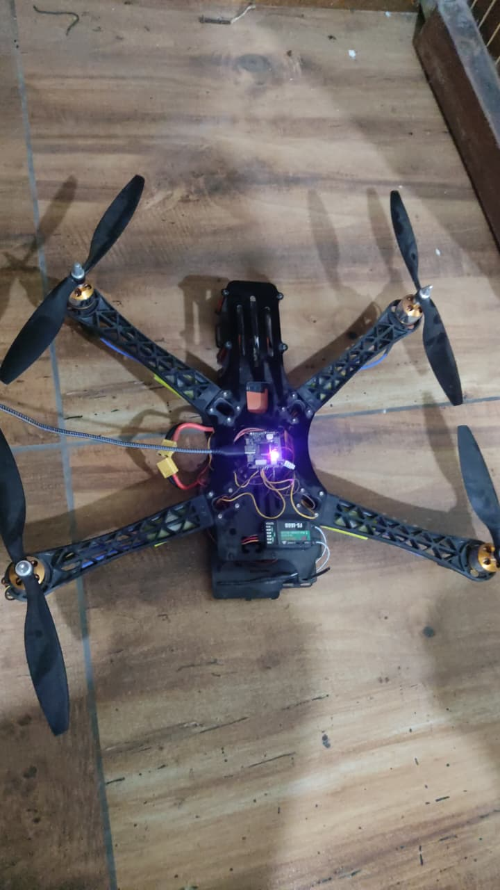
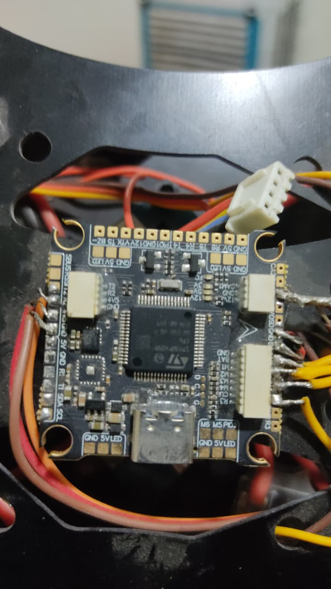
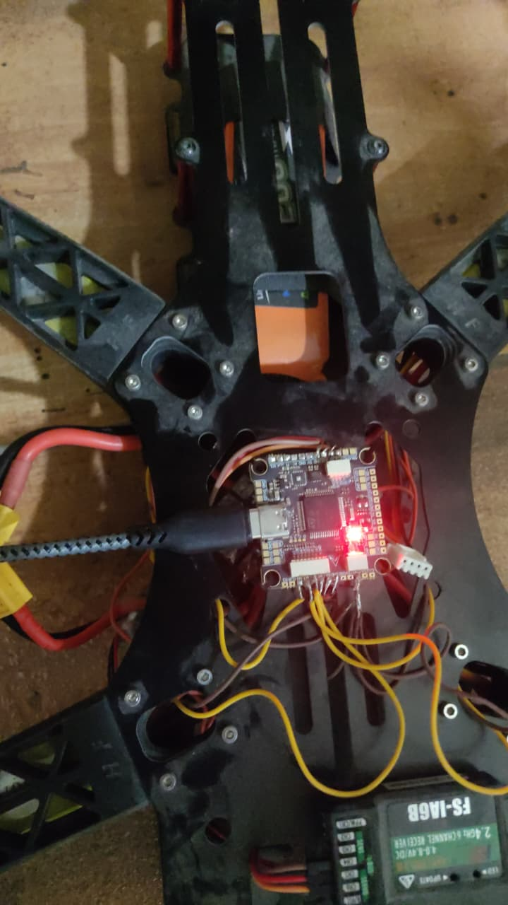
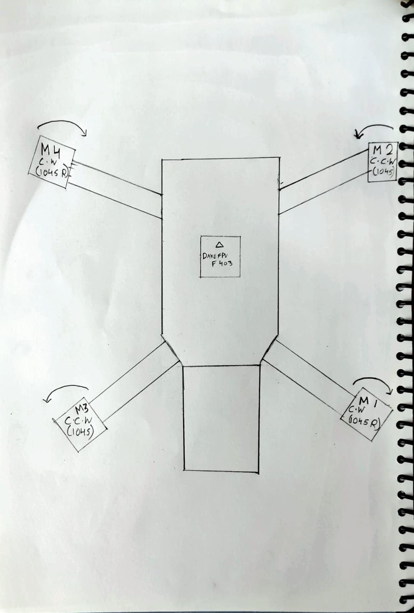

# My 500mm Quadcopter Project

Hey there! Welcome to my custom 500mm drone build log and diagnostic testbed. I originally started this out on an old 8-bit APM setup, but lately I decided to move it over to a 32-bit STM32F405 flight controller. This way I could really dive into the low-level PWM signals and test the motor commutation without all the complex autonomous flight checks getting in the way.

## What's on the drone?
* **Frame:** 500mm Diagonal (like a TBS 500)
* **Flight Controller:** DakeFPV F405 (Running STM32F405)
* **Radio:** FlySky FS-i6 Transmitter with FS-iA6B Receiver (using i-BUS)
* **Battery:** 3S LiPo
* **Software:** Betaflight 4.4+ (Flashed as DAKEFPVF405)
* **Motors:** 4x 1000KV sensorless brushless motors
* **ESCs:** Some older 30A analog ESCs (I had to mod them to fix some power issues!)

## My Notes and Logs
I've been documenting everything as I go, especially since this build fought me quite a bit!
* [The Hardware Story](docs/hardware_architecture.md) - How the build evolved and the headaches I had with STM32 timers and ground loops.
* [My Bench Tests](docs/bench_testing_log.md) - Logs from when I was testing it on the bench, tuning the ESCs and fixing motor start issues.
* [Crash & Troubleshooting Log](docs/failure_logs.md) - My diary of things that broke, weird glitches, and that time it randomly freaked out on the bench.

## Pics and Media
* **Full Drone:** 
* **FC Pinout:** 
* **Wiring Setup:** 
* **RIP Propeller:** 
* **Motor Spin Diagram:** 
* **Video:** [Bench Test Walkaround](assets/media/bench_test_walkaround.mp4)
