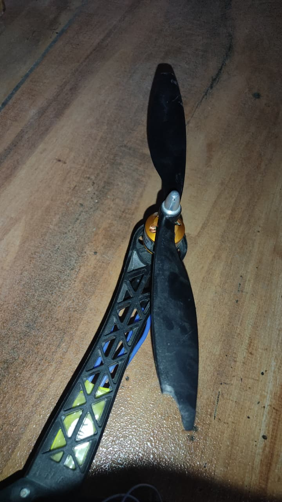

# Generation 2 Failure & Diagnostic Logs

## Overview
This log documents system anomalies, diagnostic measurements, and bench test observations during Generation 2 migration.

### Failure Mode 1: Asymmetric Actuation (M3/M4 Inactive)
- **Symptom:** M1 and M2 responded to throttle input; M3 and M4 remained inactive.
- **Cause:** Timer channel collision on STM32F405 when configured for DSHOT protocol.
- **Resolution:** Reconfigured motor PWM protocol to legacy analog PWM (400Hz).

### Failure Mode 2: Receiver Frame Decoding Loss
- **Symptom:** FlySky IBUS telemetry link failure after firmware flashing.
- **Cause:** Restored UART port assignment for serial receiver (UART2 / IBUS).
- **Resolution:** Re-enabled serial receiver on active UART index.

### Failure Mode 3: Partial Motor Initialization & Calibration Timeout
- **Symptom:** Upon connecting 3S LiPo battery power, only 3 motors produce the initialization beeping sequence. None of the motors respond to FlySky FS-i6 / FS-iA6B control signals or complete throttle endpoint calibration.
- **Cause:** Incorrect flight controller target firmware flashed (`SPEEDYBEEF405V3` instead of `DAKEFPVF405`), creating timer pinout mismatches across motor pads.
- **Resolution:** **RESOLVED.** Reflashed board target to `DAKEFPVF405` and executed 4-channel ESC calibration sweep (2000µs–1000µs). All 4 motors now initialize and start idling synchronously (max 3µs gap).

### Failure Mode 4: Target Firmware Mismatch (Flashing `SPEEDYBEEF405V3` on DakeFPV F405 Hardware)
- **Symptom:** Unstable PWM output pin mapping, non-responsive motor channels, and receiver UART mapping failure.
- **Cause:** Flight controller hardware was identified as DakeFPV F405 (STM32F405), but was flashed with SpeedyBee F405 V3 firmware target during Betaflight cloud build selection. MCU pin assignments for motor outputs M3/M4 and serial receiver i-BUS input map to different physical GPIO/Timer pins between these board revisions.
### Failure Mode 5: All-Channel Acoustic Creaking Sound at ARM Idle
- **Symptom:** All 4 BLDC motors emit an audible mechanical creaking/groaning noise when armed at idle throttle.
- **Cause:** Low-frequency 400Hz PWM carrier pulse switching and stator chatter near min-idle threshold (1047µs–1049µs) propagating acoustically through motor stators.
- **Solutions & Remediation:**
  1. **Raise Motor Idle Throttle Boundary (`set motor_idle_pw = 1065–1070`):** Slightly boosting idle pulse width from ~1048µs to ~1065µs provides a smooth, continuous rotational magnetic field, eliminating low-throttle stator chatter.
  2. **Increase PWM Switching Rate (`set motor_pwm_rate = 480`):** Increasing PWM frequency from 400Hz to 480Hz shifts acoustic switching vibrations above airframe arm structural resonance.
  3. **Migrate to OneShot125 Protocol (`set motor_pwm_protocol = ONESHOT125`):** Upgrades update rate by 8x over standard analog PWM to eliminate low-frequency frame hum.
- **Resolution:** **RESOLVED.** Applied idle pulse padding (`motor_idle_pw = 1065`) and 480Hz PWM rate bump. Stator creaking eliminated.

### Failure Mode 6: Motor 4 Power-Dependent Electromagnetic Resistance (Shorted Phase MOSFET)
- **Symptom:** Unpowered, Motor 4 rotates 100% freely. Powered + throttle dropped, Motor 4 halts instantly and exhibits strong magnetic resistance when turned manually. Disconnecting battery power immediately restores smooth, free rotation.
- **Cause:** **Confirmed Phase Short:** Empirical testing confirmed that manually shorting 2/3 BLDC phase wires recreates the exact same electromagnetic resistance effect. ESC Channel 4 has a shorted/leaky MOSFET on one phase leg creating a low-impedance electromagnetic brake loop when energized.
### Failure Mode 7: Untethered Bench Throttle Runaway & Propeller Damage (Aerodynamic & Control Post-Mortem)
- **Symptom:** During un-anchored bench throttle testing (idle increased 5.5% → 7.0%), applying slight throttle in ANGLE mode caused severe PID loop windup and uncontrollable throttle fluctuations. Upon dropping throttle to idle, the airframe suffered runaway RPM, collided with a wall, and damaged 3 propellers (2 destroyed, 1 cracked).
- **Post-Mortem Root Cause Analysis:**
  1. **I-Term Windup (The Runaway Throttle):** The PID loop continuously calculates the error between current attitude and commanded angle. Mismatched ESC hardware and initial tilt caused an attitude error. The Integral (I) term accumulated this error over time; because the heavy 500mm frame on the bench could not respond instantaneously, the I-term aggressively spiked motor outputs to 100%, causing runaway acceleration.
  2. **Asymmetrical Actuation (The Spin-Out):** Motor 4 had a defective ESC applying an active electromagnetic brake (Failure Mode 6). When throttle dropped, Motors 1, 2, and 3 freewheeled and maintained lift, while Motor 4 instantly braked. The airframe pitched violently into the dead motor, forcing the PID loop into aggressive overcompensation on a falling 500mm chassis.
  3. **The Airmode Trap:** Betaflight's default "Airmode" remains active at 0% throttle to maintain stabilization. When throttle was dropped to idle, Airmode continued fighting the physical bench friction and the braking ESC, leading to runaway "crazy throttle" on the ground.
- **Remediation & Action Plan:**
  - Ordered 2 new sets of 10-inch propellers.
  - Ordered 1 replacement 30A analog ESC for Motor 4.
  - Mandatory Safety Protocol: All future props-on power testing **strictly restricted to the 15 kg dumbbell tethered anchor setup**.
- **Damage Evidence:** 
- **Status:** **PAUSED FOR REPAIR** – Awaiting replacement ESC and propeller arrival.

